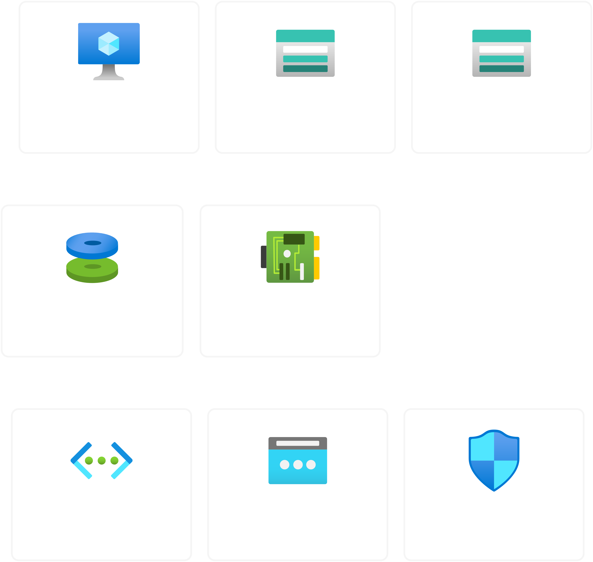
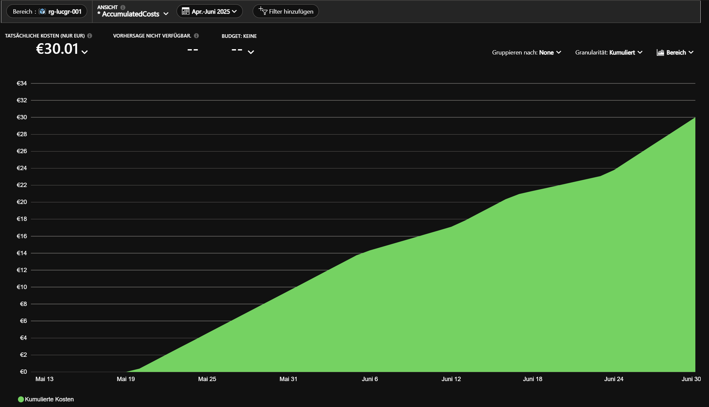

# Woche 1 - Journal

## Thema: Eine Simple Infrastruktur in Terraform bauen. 

### Projektplanung und Struktur

- Projektziel definiert: Wetter Dashboard mit KI
- Entscheidung für Azure, AKS, PostgreSQL, Terraform und öffentliches HTTPS
- Nutzung von nip.io für Domains, keine eigene Domain notwendig

### Architektur-Diagramm Vorstellung 
[Architektur-Diagramm](Architekturdiagramm.drawio)

### Terraform Setup erstellt

- Lokale Terraform Projektstruktur mit Modulen aufgebaut
- Module implementiert für:
  - AKS Cluster (mit Autoscaling von 1 bis 2 Nodes)
  - PostgreSQL Flexible Server
  - Storage Account + Container für Backups
  - Azure Container Registry
- Remote State mit Azure Blob Storage in der Region northeurope erfolgreich eingerichtet

### Fehlerbehebung und Optimierungen

- Zugriff auf das Remote Backend korrigiert
- Provider Version angepasst
- Fehler in sku_name, Version, HA, Autoscaling, Storage Namen behoben
- PostgreSQL korrekt mit gültigem SKU und Version konfiguriert
- AKS-Konfiguration auf min_count = 1 angepasst für funktionierendes Autoscaling

### Nächste Schritte vorbereitet

- Ingress mit Public IP und nip.io Domain geplant
- cert-manager und Let's Encrypt für HTTPS bereit
- App Deployments, Ingress und CI/CD sind als nächste Schritte vorgesehen

# Woche 2 - Journal

## Thema: Deployment einer Container basierten Wetter-App auf Azure VM mit HTTPS

### Was wurde heute erreicht?

- **Docker + NGINX Setup auf Azure VM**
   - VM mit Terraform deployed (inkl. NSG, SSH-Zugriff, Static IP)
   - Docker + Docker Compose erfolgreich installiert und getestet (mit `hello-world`)
   - Containerisierte App (Frontend, API, ML-Service, Proxy) lokal auf VM deployed

- **Nginx-Reverse-Proxy**
   - Eigener NGINX Container für HTTP Routing auf Port 80
   - Proxy Routing konfiguriert für `/`, `/api/` und `/ml/` zu den entsprechenden Services

- **HTTPS mit Let's Encrypt (Certbot)**
   - NIP.IO Domain (`13.74.162.14.nip.io`) verwendet
   - Zertifikat erfolgreich mit Certbot (Webroot Modus) generiert
   - HTTPS Serverblock in nginx eingerichtet
   - HTTP auf HTTPS Weiterleitung per `return 301` eingerichtet

- **Frontend mit API verbunden**
   - API liefert Wetter Dummy Daten via `/api/weather`
   - Frontend ruft API über `fetch()` auf
   - Encoding Bug (UTF-8) in HTML erkannt und gefixt
   - Ausgabe: Wetterdaten dynamisch auf Webseite angezeigt

### Aktuelles Diagramm

### Probleme & Lösungen

| Problem                             | Lösung                                                               |
|------------------------------------|----------------------------------------------------------------------|
| Certbot schlägt fehl wegen nginx.pid | Certbot auf Webroot Modus umgestellt                                |
| "Not Found" bei API                | Proxy `/api/` + FastAPI Pfad `/api/weather` → angepasst auf `/weather` |
| Sonderzeichen falsch dargestellt   | `<meta charset="UTF-8">` im HTML Header ergänzt                     |
| Port 443 nicht erreichbar          | NSG Regeln in Terraform geprüft + Certbot korrekt ausgeführt        |

### Warum kein AKS?

Ursprünglich war geplant, die App auf Azure Kubernetes Service (AKS) zu deployen. Beim Terraform Deployment kam es jedoch zu einem Berechtigungsfehler:

- **Problem:** Kein Zugriff auf `Microsoft.ContainerService/register/action`
- **Ursache:** Azure Playground Account ohne nötige Rechte zur Registrierung des AKS-Providers
- **Lösung:** Wechsel auf Azure Virtual Machine als Alternative (manuelles Container Hosting via Docker)

Dadurch konnten alle nötigen Services (API, Frontend, ML, Proxy) direkt über Docker Compose betrieben werden.

### Was habe ich gelernt?

- Wie man eine Azure-VM mit Terraform provisioniert
- Docker + Docker Compose produktionsnah aufsetzt
- HTTPS mit Let’s Encrypt und NGINX korrekt integriert
- Basics zu NGINX Reverse Proxy & FastAPI Pfad Handling
- Cleanes Zusammenspiel zwischen Infrastruktur, Backend und Frontend
- Umgang mit Fehlern im Encoding und Routing

# Lernjournal 3 + 4

## Thema: Integration eines ML-Moduls in die Wetter-App

### Zielsetzung
Das Ziel war es, ein Machine Learning Modul in die bestehende Wetter-App zu integrieren, welches eine zusätzliche 7 Tage Vorhersage bereitstellt, weil der free tier der API nur eine 3 Tage Vorhersage anbietet, wird mit ML-Modul noch die restlichen Tage der Wochen predicted. Dabei sollte das ML-Modul unabhängig als Microservice über FastAPI laufen und historische Wetterdaten nutzen. Auch damit die Webseite nicht mehr über die IP Addresse aufgerufen werden muss, wird mit DuckDNS eine Domain erstellt, im nginx.conf wird dann einfach die Addresse angepasst.

### Was wurde heute erreicht?

- DuckDNS Domain eingerichtet, damit die App nicht immer mit der IP aufgerufen werden muss.
- Aufbau eines eigenständigen Docker Containers für das ML-Modul (`ml`)
- Implementierung eines `train.py` Moduls zur Vorhersage der Temperatur mit echten historischen Wetterdaten über die WeatherAPI
- Einführung einer gemeinsamen Code Basis (`shared/weather_utils.py`) zur Wiederverwendung von API Funktionen
- Erstellung eines FastAPI-Endpunkts `/forecast` im `ml` Service
- Konfiguration des Dockerfiles und `docker-compose.yml` zur Einbindung von `shared/`
- Erweiterung von nginx zur Weiterleitung von `/ml/forecast` Anfragen bei vorhandenem Sicherheitsschlüssel
- Absicherung des ML-Endpunkts durch `X-Internal-Key` Header
- Behebung von Laufzeitfehlern durch korrekte `CMD` und Netzwerkdefinitionen
- Troubleshooting von HTTP Kommunikationsproblemen zwischen nginx und dem ML-Service

### Herausforderungen

- Die Verbindung von nginx zum ML-Service war fehleranfällig. Die Meldung „Invalid HTTP request received“ wurde durch inkorrekte Header oder unvollständige Requests verursacht.
- Das Container Netzwerk musste richtig konfiguriert sein, damit Dienste sich untereinander erreichen konnten.
- Das Logging im Container war entscheidend, um zu erkennen, dass `uvicorn` korrekt läuft, die Requests aber vom Client nicht vollständig oder fehlerhaft gesendet wurden.

### Nächste Schritte

- Finalisierung der Kommunikation zwischen Frontend und ML-Modul, sodass die erweiterten Vorhersagen im UI angezeigt werden
- Optional: Trainiertes Modell zwischenspeichern (statt bei jeder Anfrage zu trainieren)
- Auswertung der Prognosequalität durch Validierung mit echten Wetterdaten
- Styling Anpassung des Frontends für die neue 7 Tage Vorhersage

### Was habe ich gelernt

Das heutige Arbeiten hat gezeigt, wie wichtig klare Modultrennung, Logging und systematische Fehleranalyse sind. Die Idee, das ML-Modul als eigenständigen Service mit API-Key-geschütztem Zugang bereitzustellen, ist robust und erweiterbar. Auch wenn es technische Stolpersteine gab, konnte durch systematisches Testen und Isolieren der Komponenten der Fehler eingegrenzt und das System stabilisiert werden.

# Woche 5 - Monitoring, Backups und Betriebsfähigkeit

## 1. Monitoring mit Prometheus & Grafana

- Ziel: Betriebsmetriken der VM sowie der Container live überwachen
- Entscheidung für Prometheus + Node Exporter (Systemmetriken) und Grafana (Dashboarding)
- Prometheus & Grafana über Docker Compose als Services deployt
- Prometheus scrape-config für node_exporter (auf Port 9100) erstellt
- Node Exporter Container im Compose-Netzwerk bereitgestellt
- Grafana initial über Port 3000, später sicher via nginx/HTTPS unter `/grafana/` erreichbar gemacht
- Grafana-Umgebungsvariable `GF_SERVER_ROOT_URL` für Subpath-Betrieb gesetzt
- Node Exporter Dashboard (ID: 1860) in Grafana importiert und konfiguriert

### Herausforderungen & Lösungen

| Problem                      | Lösung                                                               |
|------------------------------|----------------------------------------------------------------------|
| Node Exporter via `network_mode: host` führte zu Problemen | Standard Compose-Netz genutzt, Port explizit gemappt               |
| 502 Bad Gateway beim Zugriff auf Grafana      | nginx location-Block, Rewrite-Rule und richtige Container-URL gesetzt  |
| Prometheus konnte node_exporter nicht erreichen | Korrekte Compose-Service-Names und Ports in `prometheus.yml` genutzt |
| Zugriff aus Internet         | NSG-Regel in Terraform für Port 3000 gesetzt, später HTTPS-Proxy via nginx |

---

## 2. Backups der App-Struktur

- Fokus auf Container- und App-Daten (kein DB-Backup, da Datenquelle extern)
- Bash-Script zum Packen der gesamten App (`tar.gz` von `/weather-app/`)
- Upload ins Azure Storage (Container `backup`) mittels `azcopy`
- SAS-Token sicher aus Datei (`SAS_key.txt`) gelesen statt im Script
- Wöchentlicher Cronjob (`crontab -e`) zur Automatisierung:  
`0 3 * * 2 /home/azureuser -c "/backup.sh"`
- Backup-Prozess getestet: Upload & Berechtigungskonflikte erfolgreich gelöst

---

## 3. Troubleshooting & Lessons Learned

- Networking und DNS-Namen im Docker Compose entscheiden über Erfolg des Setups
- **azcopy** ist deutlich schlanker & automationsfreundlicher als Azure CLI für Backups
- Nie Credentials oder SAS-Keys im Klartext oder Git speichern – stattdessen Datei oder Secret-Mount
- Monitoring mit Grafana bringt sehr schnelle Sichtbarkeit von Ressourcenengpässen und hilft beim Troubleshooting

---

## 4. Nächste Schritte

- **Logging**-Stack mit Fluent Bit und Loki aufsetzen
- **Alerting** in Grafana für kritische Metriken (z.B. CPU-Auslastung, Festplattenplatz, Nicht-Erreichbarkeit der API)
- Dokumentation und Start-up Script für vollautomatisches Restore der App auf neue VM mit Terraform-Pipeline entwerfen
- Optional: Monitoring/Logging für API-Calls und ML-Vorhersagen ergänzen (Prometheus Middleware in FastAPI)

---

## Reflexion

- Die Abkehr von klassischem Datenbank-Backup und stattdessen ein Infrastruktur- und App-Dump ist für stateless Apps mit externen APIs schlank, günstig und praktisch.
- Monitoring mit Open-Source-Tools im eigenen Stack zu betreiben ist eine realistische Cloud-Native-Practice und gibt volle Kontrolle über Daten und Alerts.
- Infrastruktur als Code (Terraform) ermöglicht das Setup und Restore auf Knopfdruck – wichtig für Wartbarkeit und Kostenkontrolle in der Cloud.

---

# Woche 6 + 7 – Betrieb und Abschluss

## 1. Gesamtüberblick & Automatisierung

- **Alle zentralen Betriebsaufgaben automatisiert:**  
  - Infrastruktur (Terraform)
  - App-Deployment (Docker Compose)
  - HTTPS + Domain Routing (nginx, DuckDNS)
  - Monitoring (Prometheus/Grafana)
  - Backups (azcopy + cron)
- **Alles ist dokumentiert** und reproduzierbar, inkl. Troubleshooting-Erkenntnisse

## 2. Projekt-Highlights

- Stateless Architektur: App kann auf neuer VM in Minuten wiederhergestellt werden
- Überwachung und Logging (inkl. Visualisierung per Dashboard) sind dauerhaft aktiv
- Infrastruktur-Kosten optimiert: PostgreSQL deaktiviert, Storage Accounts minimal genutzt
- Backup/Restore-Pfade vorbereitet für vollautomatisierte Disaster Recovery

---

## 2. Datenpersistenz & Betriebssicherheit

* **Persistente Volumes** in `docker-compose.yaml` für Prometheus (`prometheus-data`) und Grafana (`grafana-data`) hinzugefügt.
* Nach Docker-Restarts bleiben Dashboards, Prometheus-Daten und User-Einstellungen erhalten.
* Grafana-Konfiguration (`GF_SERVER_ROOT_URL`) für Subpath-Betrieb im Reverse Proxy angepasst.

## 3. Troubleshooting & Lessons Learned

* Fehlerursachen beim Monitoring identifiziert:

  * Docker Compose Netzwerke und Service-Namen sind kritisch für funktionierende Kommunikation!
  * Internal DNS (`host.docker.internal`) funktioniert nicht wie lokal, sondern nur Service-Name (`api`, `ml` usw.) im Compose-Netz.
  * Probleme mit Speicher- und Ressourcenknappheit der VM führten zu Ausfällen – Lösung: VM-SKU über Terraform hochgestuft.
  * Prometheus Targets und Ports immer wieder angepasst, bis alle Services dauerhaft „UP“ sind.

## 4. Verbesserte Benutzerfreundlichkeit: Cookies & Frontend-Styling

* **Cookies** im Frontend (JS): Die zuletzt gewählte Stadt wird im Browser gespeichert und bei erneutem Laden automatisch vorgeschlagen.

  * Eigene Cookie-Helper in `script.js` implementiert (`setCookie`, `getCookie`).
  * Funktion per DevTools getestet und validiert (Cookies werden gesetzt/gelesen).
* **Frontend Styling**: Das Wetter-Frontend deutlich verschönert:

  * CSS so gestaltet, dass alle Ausgaben in modernem Card-Design erscheinen.
  * ML-Prognosen und Wetterdaten im gleichen Stil und mit konsistenter Typografie ausgegeben.
  * Flexibles Layout (zentriert, mobilfreundlich, klare Typografie, Platzhalter für Icons/Bilder vorbereitet).
  * Feedback von Testpersonen zur UI aufgenommen und umgesetzt.
* Fehler bei der Anwendung des Styles nach Rebuilds erkannt und gelöst (Container neu gebaut, Browser Cache geleert, Hard Reload durchgeführt).

---

## 5. Aktueller Stand

* **Die App ist voll funktionsfähig**:

  * Monitoring (Prometheus, Grafana) läuft persistent
  * Dashboards & Daten gehen bei Container-Restarts nicht verloren
  * Nutzer können die Stadt im Frontend wählen, der Wert bleibt dank Cookies gespeichert
  * Das Frontend sieht modern und übersichtlich aus, Styling ist konsistent und vorbereitet für weitere Visuals (z.B. Wetter-Icons)
  * App ist resilient gegen VM-Restarts, da alles dokumentiert und als Code/Config vorhanden ist
  * Kostenanalyse Azure:

---

## Reflexion

* Monitoring, Logging und UI-Polishing sind keine „Nebensache“, sondern entscheidend für einen robusten Betrieb
* Ohne Docker-Volumes und richtige Netzwerk-Namen funktioniert nichts dauerhaft – Infrastruktur als Code zahlt sich aus!
* Feedback-Schleifen (Fehleranalyse im Betrieb, User-Tests im Frontend) sind für die Stabilität und Akzeptanz mindestens so wichtig wie die technische Umsetzung

---

## Fazit

- Cloud- und Container-Technologien ermöglichen hochverfügbare, günstige und portable Web-Projekte, auch ohne grossen Aufwand für klassische DB-Backups
- Die systematische Dokumentation, Tests und Automatisierung sorgen für maximale Resilienz
- Monitoring und regelmässige Backups sind unverzichtbar für den Betrieb produktiver Systeme